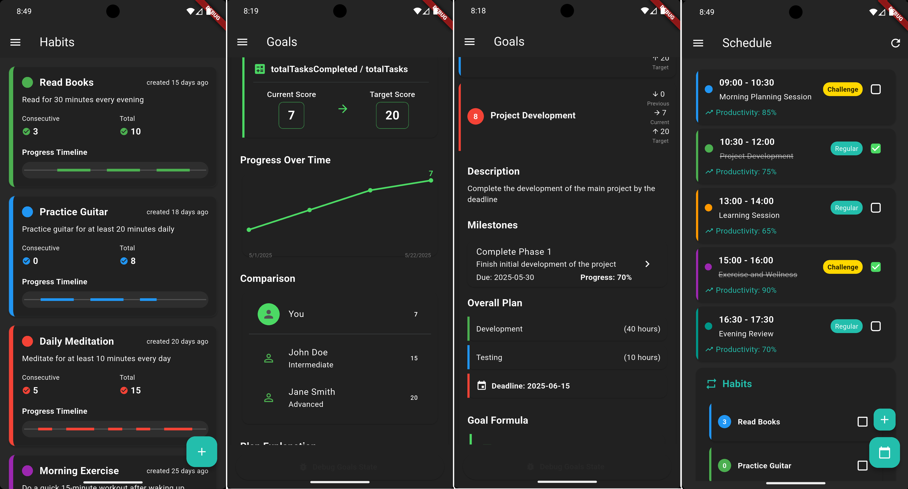

# Life Wizard

**Life Wizard** is a cross-platform productivity and personal development application built with Flutter. Its mission is to empower users to set, track, and achieve their life goals through a blend of structured planning, intelligent assistance, and motivational support.



---

## 🌟 Key Features

### 🎯 Goal Management & Tracking
- **Create and Organize Goals**: Define short-term and long-term goals, categorize them by priority, and add detailed descriptions.  
- **Milestones & Tasks**: Break down each goal into actionable milestones and tasks, complete with deadlines, progress indicators, and status updates.  
- **Progress Visualization**: Use visual dashboards and charts to monitor your progress, compare achievements, and stay motivated.

### 🤖 AI-Powered Assistant
- **Smart Goal Creation**: Brainstorm, refine, and create goals with detailed roadmaps using the integrated AI chat.  
- **Dynamic Updates**: Update goals, progress, and plans through natural language conversations with the AI assistant.  
- **Personalized Suggestions**: Receive tailored advice and encouragement based on your activity and progress.

### ⏰ Pro Clock & Time Management
- **Productivity Timer**: Use the Pro Clock widget to track task durations, implement techniques like Pomodoro, and boost focus.  
- **Task Scheduling**: Plan your day, allocate time blocks, and receive reminders to stay on track.

### 💡 Motivation & Inspiration
- **Stoic & Success Quotes**: Access a curated library of motivational quotes for resilience, discipline, and a growth mindset.  
- **Daily Inspiration**: Get a new quote or tip each day to keep you motivated.

### 📊 Comprehensive Dashboard
- **All-in-One Overview**: View goals, habits, tasks, and progress in a single, easy-to-navigate dashboard.  
- **Comparison & Benchmarking**: Track your progress against targets or community averages.

---

## 🛠️ Built with Modern Technologies
- **Flutter SDK (>= 3.7.2)**: Ensures a smooth, responsive experience on both mobile and desktop platforms.  
- **State Management & Persistence**: Provides a robust architecture for reliable data storage and seamless user experience.

---

## 🚀 Why Life Wizard?

Life Wizard is more than just a to-do list or habit tracker. It’s a holistic life management tool designed to help you:  
- Set meaningful goals and break them into achievable steps.  
- Stay accountable and motivated with visual progress and AI support.  
- Reflect on your journey and continuously improve.

Whether you're striving for personal growth, career advancement, or better daily habits, Life Wizard provides the structure, insight, and encouragement you need to succeed.

---

### 📌 Installation
To get started, clone the repository and ensure Flutter SDK is installed:  
```bash
git clone https://github.com/Majidi-star/Life-Wizard.git
cd life-wizard
flutter pub get
flutter run